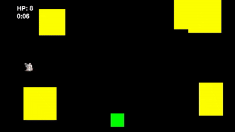

# yokeru
Pythonの練習でちょっとしたミニゲームを作る 
A simple mini-game created as a Python learning exercise.

## 🎮 ゲーム概要/Game Overview
プレイヤー（緑の四角）を左右に動かし、 上からランダムなサイズと速度で落ちてくる障害物（黄色の四角）を避けて、できるだけ長く生き残るゲームです。 
Control the player (green square) to dodge obstacles (yellow squares) falling from above at random sizes and speeds. Survive as long as you can!

## 🕹️ 操作方法/Instructions
Left Arrow Key (←): Move left 
Right Arrow Key (→): Move right

## 🚀 動作環境/System Requirements
Python 3.x 
pygame

## 進捗/Progress
| Date | Task |
| :--- | :--- |
| 2026-6-13 | プレイヤーの操作と落ちてくる障害物の実装 |
| 2026-6-14 | 当たり判定、HP、生き残った時間の実装 |
| 2026-6-16 | PB機能の実装 |
## 🛠️ 今後の追加予定 / Future Plans
- [x] 当たり判定とHPシステムの実装 / Implement collision detection and HP system
- [x] スコアと生存時間の実装 / Add score and survival time tracking
- [x] 自己ベストの保存機能の実装 / Add personal best saving functionality

### 🌟 やる気が出たら追加したい機能 / Bonus Features (If motivated!)
- [ ] 効果音とBGMの追加 / Add sound effects and BGM
- [ ] プレイヤーや障害物の画像化 / Replace squares with custom graphics
- [ ] ゲームオーバー画面の実装 / Add a Game Over screen

